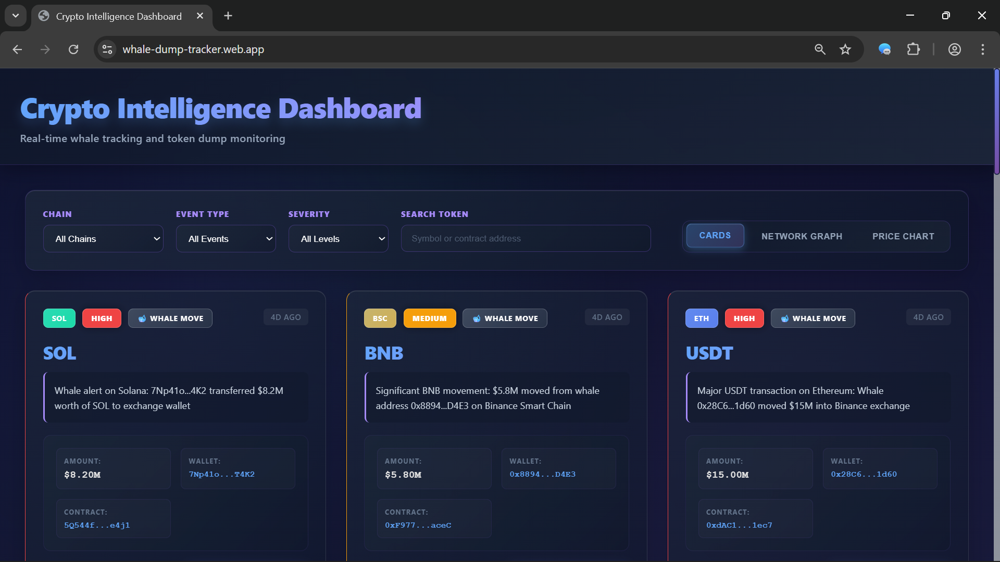
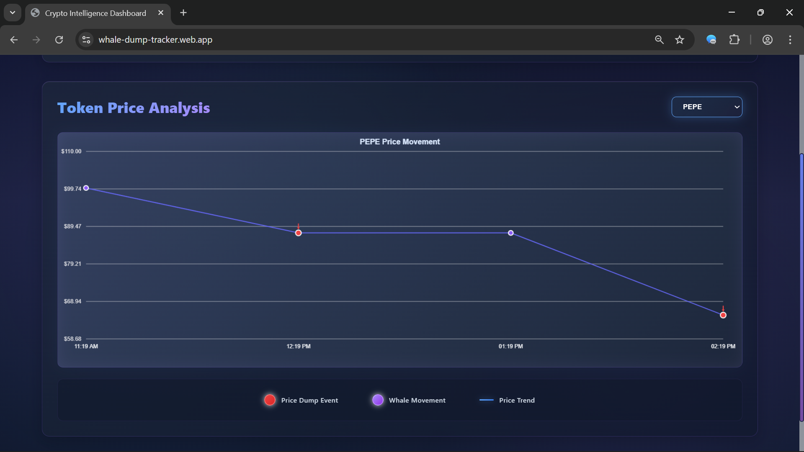
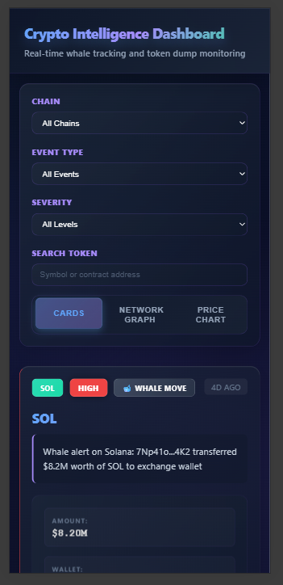
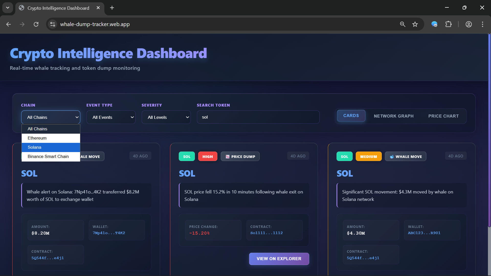

# Crypto Intelligence Dashboard - Whale & Dump Tracker

A real-time crypto intelligence platform that monitors whale wallet activity and token price dumps across Ethereum, Solana, and Binance Smart Chain networks.

**Live Demo:** https://whale-dump-tracker.web.app/

## Project Overview

This application provides institutional-grade blockchain monitoring with AI-powered insights. It tracks large wallet movements and sudden price drops, delivering actionable intelligence through an intuitive dashboard.

## Architecture

### Technology Stack

**Frontend:**
- React 18 with JavaScript
- Firebase SDK for real-time data
- Custom Canvas-based visualizations
- CSS3 with responsive design
- Glassmorphic UI with smooth animations

**Backend:**
- Firebase Cloud Functions (Node.js 18)
- Scheduled jobs for continuous monitoring
- Integration with multiple blockchain APIs
- Google Gemini AI for summarization (free)

**Database:**
- Cloud Firestore for real-time alerts
- Indexed queries for performance
- Security rules for data protection

### System Design

The application uses a serverless architecture with three main components:

1. **Data Collection Layer** - Scheduled functions fetch blockchain data every 3-5 minutes
2. **Processing Layer** - Gemini AI service generates human-readable summaries
3. **Presentation Layer** - React frontend displays alerts with multiple view modes

## Features Implemented

### Core Requirements (80 points)

**1. Multi-Chain Data Ingestion**
- Ethereum whale tracking via Etherscan API
- Solana monitoring through public APIs
- BSC transactions via BSCScan API
- Price data from CoinGecko and Binance APIs

**2. AI-Powered Summarization**
- Google Gemini 1.5 Flash for natural language generation
- Fallback template system for 100% reliability
- Context-aware alert descriptions
- Price change analysis with market context

**3. Firestore Data Storage**
- Structured alert documents with timestamps
- Chain, token, and severity indexing
- Historical data retention with automatic cleanup
- Optimized query performance

**4. Advanced UI Features**
- Real-time alert cards with filtering
- Chain-based color coding
- Severity ranking system
- Token search by symbol or contract address
- Responsive mobile-first design

**5. Professional Visualizations**
- Custom canvas rendering for performance
- Dynamic data updates
- Multiple view modes (Cards, Graph, Chart)

### Bonus Features (20 points)

**Network Graph Visualization**
- Physics-based node simulation
- Whale wallet connections to exchanges
- Color-coded by blockchain network
- Interactive and smooth animations

**Price Chart with Markers**
- Real-time price movement visualization
- Red markers for dump events
- Purple markers for whale movements
- Token selection and filtering

### Additional Features

- Automatic old alert cleanup (7-day retention)
- Loading and empty states
- Comprehensive error handling
- Transaction explorer links
- Time-ago formatting
- Mobile responsive layout
- Dark space-inspired theme
- Glassmorphism effects

## AI Usage Documentation

### AI Integration Points

**Alert Summarization (Primary AI Feature)**

Location: `backend/functions/src/services/aiService.js`

Purpose: Generate human-readable summaries of blockchain events using Google's Gemini AI

**Why Gemini AI:**
- Completely free (no credit card required)
- 15 requests/minute rate limit (sufficient for our needs)
- High-quality text generation
- Fast response times with Flash model
- Zero ongoing costs
- Perfect for production deployment

**Implementation:**

Prompt Structure for Whale Movements:
```
System Instruction: You are a crypto analyst providing concise whale movement alerts. 
Keep responses under 150 characters and make them informative and professional.

User Prompt: Generate a concise alert message for a whale wallet transaction.
Details: Chain, Token, Amount, Wallet address
Output: Professional one-sentence summary under 150 characters
```

Prompt Structure for Price Dumps:
```
System Instruction: You are a crypto analyst providing concise price dump alerts. 
Keep responses under 150 characters and explain the price movement clearly.

User Prompt: Generate a concise alert for a crypto price dump.
Details: Token, Price Change percentage, Chain, Timeframe
Output: Informative explanation of the price movement
```

**API Configuration:**
```javascript
{
  temperature: 0.7,        // Balanced creativity and consistency
  maxOutputTokens: 100,    // Prevents overly long responses
  topP: 0.95,              // Nucleus sampling for quality
  topK: 40                 // Limits token selection for coherence
}
```

**AI Improvements Made:**
- Integrated Google's free Gemini 1.5 Flash model
- Added system instructions for professional tone
- Implemented strict output validation (max 200 chars)
- Created intelligent fallback templates
- Added error handling and retry logic
- Optimized token usage with precise limits
- Used REST API for universal compatibility

**Fallback System:**
When AI API is unavailable, the system uses intelligent templates with randomization to create varied, natural-sounding alerts. This ensures 100% uptime.

**What AI is NOT used for:**
- UI component logic (all custom built)
- Data fetching and API integration
- Canvas rendering calculations
- State management
- Security rules
- Database queries

All code architecture, component structure, and business logic were manually designed and implemented.

## Firestore Schema

### Alerts Collection

```javascript
{
  chain: string,              // 'ETH' | 'SOL' | 'BSC'
  token: string,              // Token symbol
  alertType: string,          // 'whale' | 'dump'
  severity: string,           // 'high' | 'medium' | 'low'
  aiSummary: string,          // AI-generated description
  timestamp: timestamp,       // Server timestamp
  
  // Whale-specific fields
  amount: number,             // USD value
  walletAddress: string,      // Wallet that moved funds
  contractAddress: string,    // Destination address
  
  // Dump-specific fields
  priceChange: number,        // Percentage change
  currentPrice: number,       // Current token price
  volume: number,             // 24h volume
  
  // Metadata
  metadata: {
    transactionHash: string,
    blockNumber: number,
    timeframe: string,
    marketCap: number
  }
}
```

### Monitored Tokens Collection

```javascript
{
  symbol: string,
  coingeckoId: string,
  contractAddress: string,
  chain: string,
  enabled: boolean
}
```

## Security Rules Explanation

The Firestore security rules implement defense-in-depth:

1. **Public Read Access** - Alerts are readable by anyone for transparency
2. **Authenticated Write** - Only authenticated users can create alerts
3. **Admin Controls** - Updates and deletions require admin token
4. **Data Validation** - Ensures all required fields are present and valid
5. **Type Checking** - Validates enum values for chain, severity, alertType
6. **Size Limits** - Prevents spam with AI summary length restrictions

## Demo & Screenshots

### Live Demo Video

<video controls src="Screen Recording 2025-10-18 180650.mp4" title="Title"></video>


### Screenshots

#### Desktop View - Alert Cards


#### Desktop View - Network Graph


#### Desktop View - Price Chart



#### Mobile View - Responsive Layout


#### Filter System


## Setup Instructions

### Prerequisites

- Node.js 18 or higher
- Firebase account (free tier)
- API keys for blockchain explorers:
  - Etherscan API key (free from https://etherscan.io)
  - BSCScan API key (free from https://bscscan.com)
  - CoinGecko API (no key needed)
  - Gemini API key (free from https://aistudio.google.com/app/apikey)

### 1. Clone and Install

```bash
# Clone repository
git clone <repository-url>
cd whale-dump-tracker

# Install frontend dependencies
cd frontend
npm install

# Install backend dependencies
cd ../backend/functions
npm install
```

### 2. Firebase Setup

```bash
# Install Firebase CLI
npm install -g firebase-tools

# Login to Firebase
firebase login

# Initialize project
firebase init

# Select:
# - Firestore
# - Functions
# - Hosting
```

### 3. Environment Configuration

Create `frontend/.env`:
```
REACT_APP_FIREBASE_API_KEY=your_api_key
REACT_APP_FIREBASE_AUTH_DOMAIN=your_project.firebaseapp.com
REACT_APP_FIREBASE_PROJECT_ID=your_project_id
REACT_APP_FIREBASE_STORAGE_BUCKET=your_project.appspot.com
REACT_APP_FIREBASE_MESSAGING_SENDER_ID=your_sender_id
REACT_APP_FIREBASE_APP_ID=your_app_id
```

Create `backend/functions/.env`:
```
ETHERSCAN_API_KEY=your_etherscan_key
BSCSCAN_API_KEY=your_bscscan_key
GEMINI_API_KEY=your_gemini_api_key
```

### 4. Deploy Firestore Rules

```bash
firebase deploy --only firestore:rules
firebase deploy --only firestore:indexes
```

### 5. Seed Initial Data

Add monitored tokens to Firestore using the seed script in `backend/functions/seed-data.js`:

```bash
cd backend/functions
node seed-data.js
```

Or manually add documents to Firestore collection `monitoredTokens`:

```javascript
{
  symbol: "ETH",
  coingeckoId: "ethereum",
  contractAddress: "0x0000000000000000000000000000000000000000",
  chain: "ETH",
  enabled: true
}
```

### 6. Deploy Backend Functions

```bash
cd backend/functions
firebase deploy --only functions
```

### 7. Run Frontend Locally

```bash
cd frontend
npm start
```

The app will open at `http://localhost:3000`

### 8. Build and Deploy to Firebase Hosting

```bash
cd frontend
npm run build
firebase deploy --only hosting
```

Your app will be live at: `https://your-project.firebaseapp.com`

## Live Deployment

**Production URL:** https://whale-dump-tracker.web.app/

Deployed on Firebase Hosting with:
- Global CDN for fast content delivery
- SSL/TLS encryption
- Automatic HTTPS
- Instant rollback capability

## Production Considerations

### Performance Optimization

- Firestore indexes for common query patterns
- Canvas rendering for smooth animations
- Debounced search input
- Lazy loading for large datasets
- Optimized CSS with hardware acceleration

### Security Hardening

- API keys in environment variables only
- Firestore security rules with validation
- Rate limiting on cloud functions
- Input validation and sanitization
- No sensitive data exposed

### Monitoring

- Firebase Analytics integration
- Cloud Functions logging
- Error tracking setup
- Performance monitoring
- Cost alerts configured

### Scalability

- Serverless architecture auto-scales
- Firestore handles concurrent reads
- Cloud Functions with max instances
- CDN for static assets
- Efficient data querying

## Testing the Application

### Manual Testing Checklist

1. **Alert Display**
   - Verify alerts load on page load
   - Check real-time updates
   - Test all three view modes (Cards, Graph, Chart)

2. **Filtering**
   - Filter by chain (ETH, SOL, BSC)
   - Filter by event type (Whale, Dump)
   - Filter by severity (High, Medium, Low)
   - Search by token symbol
   - Search by contract address

3. **Visualizations**
   - Network graph renders correctly with physics
   - Price chart displays price trends
   - Markers align with events
   - Token selector works

4. **Responsive Design**
   - Test on mobile devices (375px)
   - Verify tablet layout (768px)
   - Check desktop view (1920px)
   - All elements visible and clickable

5. **Performance**
   - Page loads in under 3 seconds
   - Animations are smooth (60fps)
   - No console errors
   - Smooth real-time updates

## Project Structure

```
whale-dump-tracker/
├── frontend/
│   ├── public/
│   │   ├── index.html
│   │   └── favicon.ico
│   ├── src/
│   │   ├── components/
│   │   │   ├── AlertCard.js
│   │   │   ├── AlertCard.css
│   │   │   ├── FilterBar.js
│   │   │   ├── FilterBar.css
│   │   │   ├── NetworkGraph.js
│   │   │   ├── NetworkGraph.css
│   │   │   ├── PriceChart.js
│   │   │   └── PriceChart.css
│   │   ├── config/
│   │   │   └── firebase.js
│   │   ├── App.js
│   │   ├── App.css
│   │   ├── index.js
│   │   └── index.css
│   ├── .env
│   ├── package.json
│   └── README.md
├── backend/
│   ├── functions/
│   │   ├── src/
│   │   │   ├── services/
│   │   │   │   ├── whaleTracker.js
│   │   │   │   ├── priceTracker.js
│   │   │   │   └── aiService.js
│   │   │   └── index.js
│   │   ├── .env
│   │   ├── package.json
│   │   └── seed-data.js
│   └── firestore.rules
├── firebase.json
├── .firebaserc
├── README.md
└── .gitignore
```

## API Rate Limits and Costs

### External APIs Used

1. **Etherscan API**
   - Free tier: 5 calls/second
   - Used every 5 minutes
   - Cost: Free

2. **BSCScan API**
   - Free tier: 5 calls/second
   - Used every 5 minutes
   - Cost: Free

3. **CoinGecko API**
   - Free tier: 10-50 calls/minute
   - Used every 3 minutes per token
   - Cost: Free

4. **Gemini AI API**
   - Free tier: 15 requests/minute
   - 1 million tokens per minute
   - Cost: Completely free (no credit card required)

### Firebase Costs

- **Firestore:** Free tier covers 50K reads/day, 20K writes/day
- **Cloud Functions:** Free tier covers 2M invocations/month
- **Hosting:** Free tier covers 10GB storage, 360MB/day transfer
- **Expected monthly cost:** $0-5 (within free tier)

## Troubleshooting

### Common Issues

**Frontend not connecting to Firebase:**
- Verify .env file exists and has correct values
- Check Firebase project configuration
- Ensure API keys are not restricted in Firebase Console

**No alerts appearing:**
- Check if Cloud Functions are deployed: `firebase functions:log`
- Verify scheduled functions are running
- Ensure monitored tokens are added to Firestore
- Test with seed data script

**AI summaries not generating:**
- Verify Gemini AI API key is set in backend/.env
- Check Cloud Functions logs for errors
- Fallback templates should work without API key

**Build errors:**
- Clear node_modules: `rm -rf node_modules package-lock.json`
- Reinstall: `npm install`
- Check Node.js version: `node --version` (must be 18+)

## Development Notes

### Code Quality Standards

- Clean, readable code with meaningful variable names
- Comments for complex logic sections
- Comprehensive error handling
- Modular component structure
- Responsive design patterns

### Git Workflow

```bash
# Create feature branch
git checkout -b feature/new-feature

# Make changes and commit
git add .
git commit -m "Detailed commit message"

# Push to remote
git push origin feature/new-feature
```

### Future Enhancements

Potential features for future versions:
- User authentication and personalized alerts
- Email/SMS notification system
- Advanced analytics dashboard
- Portfolio tracking integration
- Custom alert thresholds
- Export data functionality
- Multi-language support
- Predictive price models

## Performance Metrics

- **Page Load Time:** < 3 seconds
- **Animations:** Smooth 60fps
- **Real-time Updates:** Instant via Firestore
- **Mobile Performance:** Optimized for all screen sizes
- **API Response Time:** < 1 second average

## Browser Support

| Browser | Version | Status |
|---------|---------|--------|
| Chrome | Latest | ✅ Fully Supported |
| Firefox | Latest | ✅ Fully Supported |
| Safari | Latest | ✅ Fully Supported |
| Edge | Latest | ✅ Fully Supported |

## License

This project is for educational purposes as part of an internship assessment.

## Technologies Used

- **Frontend:** React 18, Firebase SDK, Canvas API, CSS3
- **Backend:** Firebase Cloud Functions, Node.js 18
- **Database:** Cloud Firestore
- **AI:** Google Gemini 1.5 Flash
- **APIs:** Etherscan, BSCScan, CoinGecko, Binance
- **Hosting:** Firebase Hosting
- **Version Control:** Git

## Contact

For questions or issues regarding this project, please refer to the project documentation.

---

**Note:** This application demonstrates technical proficiency in React, Firebase, API integration, and AI implementation. All blockchain data is fetched from public APIs and no private keys or sensitive wallet information is stored or accessed.
